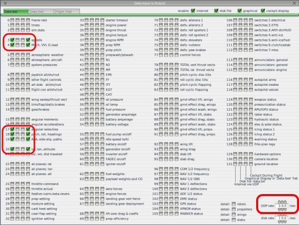

# RealFlight and X-Plane SITL
RealFlight and X-Plane SITL are two simulation environments commonly used for testing unmanned aerial vehicle (UAV) applications. Here's a summary of each tool and its features:

### RealFlight
RealFlight is a commercial software developed by Knife Edge Software that provides a comprehensive simulation environment for remote-controlled aircraft. It features highly realistic graphics, physics, and controls that allow users to simulate real-world flying conditions.

#### Features:
Realistic simulation environment: 
- RealFlight provides highly realistic graphics, physics, and controls that allow users to simulate real-world flying conditions.
- Extensive aircraft library: RealFlight includes an extensive library of aircraft models that users can choose from to simulate different types of UAVs.
- Customizable environment: RealFlight allows users to customize the environment by adjusting variables such as wind speed and direction, time of day, and weather conditions.
- Multiplayer support: RealFlight allows users to connect with other pilots for multiplayer simulation and competition.
#### Usage:
To use RealFlight for UAV testing, you'll need to purchase the software and compatible hardware, such as a transmitter and receiver.
You can then use RealFlight to simulate the behavior of your UAV under various conditions, such as different weather conditions, terrain, and flight patterns.

### X-Plane SITL
X-Plane SITL is a simulation environment developed by Laminar Research that allows users to simulate UAVs in a realistic, physics-based environment. It provides a powerful toolset for testing and developing UAV applications.

#### Features:
Realistic simulation environment: 
- X-Plane SITL provides a realistic, physics-based simulation environment that accurately models the behavior of UAVs.
- Extensive aircraft library: X-Plane SITL includes an extensive library of aircraft models that users can choose from to simulate different types of UAVs.
- Customizable environment: X-Plane SITL allows users to customize the environment by adjusting variables such as weather conditions, terrain, and flight patterns.
- Scripting support: X-Plane SITL includes support for scripting, which allows developers to automate testing scenarios and customize the simulation environment.
#### Usage:
To use X-Plane SITL for UAV testing, you'll need to download and install the X-Plane software.
You can then use X-Plane SITL to simulate the behavior of your UAV under various conditions, such as different weather conditions, terrain, and flight patterns.

## Installation

### RealFlight SITL Setup

#### Enabling RealFlight Link Feature

On RealFlight go to Settings->Physics and enable the FlightAxis
option then restart RealFlight. In RealFlight Evolution, press ESC, go to Settings->Physics->Quality and enable the "RealFlight Link" option.

#### Configure RealFlight

  - Start RealFlight (it should look exactly like regular RealFlight, there is no way to visually determine the difference)
  - Download the QuadcopterX from `ArduPilot/SITL_Models/RealFlight/Released_Models/MultiRotors/QuadCopterX/QuadcopterX-flightaxis_AV.RFX <https://github.com/ArduPilot/SITL_Models/blob/master/RealFlight/Released_Models/Multicopters/QuadCopterX/QuadcopterX-flightaxis_AV.RFX>`__.
  - Download the `parameter file for this model <https://github.com/ArduPilot/SITL_Models/blob/master/RealFlight/Released_Models/Multicopters/QuadCopterX/QuadCopterX.param>`__. Be sure its saved in text format.This will be used later.
  - Select Simulation("My RealFlight" in Evolution), Import, RealFlight Archive (RFX, G3X) and select the file QuadcopterX downloaded above.  A message, "..was successfully imported" should be displayed
  - Select Aircraft (under "Fly" in Evolution), Select Aircraft, (open "Custom Aircraft" section in Realflight) and select "QuadcopterX-flightaxis".  In the current state, the RC inputs come straight from the stick so it is not flyable.

  

From within RealFlight, Reduce graphics options to improve performance:

  - Simulation, Settings, Graphics
  - Under "Quality" set all values to "No" or "Low" (i.e. set "Clouds" to "No", "Water Quality" to "Low", etc)
  - Under "Hardware" set "Resolution" to "800 x 600 Medium(16 bit) and select "Full Screen" mode
  - Under "Physics" settings, change the option for "Pause Sim When in Background" to No, and "Automatic Reset Delay(sec)" to 2.0, and be sure RealFlight Link Enable is "Yes".
   
  
    
 .. note:: Under RealFlight's Simulation menu, Physics submenu, be sure its set at "Realistic" for best physics modeling and refresh rates.

For Evolution, you may be able to use the defaults since its graphics performance is improved. You can check the performance after connecting to SITL, as discussed below, by opening the "NavGuides" widget in Realflight. The "Graphics Frames/Sec" count needs to be over 200 for the vehicle to fly well. If it is too low, you can change similar settings in the "Settings->Graphics" Hardware and Quality sub-menus for items as described above until sufficient frame rates are obtained.
   
##### Connecting to Mission Planner's SITL

.. note:: On many older, yet Windows 10 compatible PCs, there may not be sufficient processing power to smoothly run the Mission Planner SITL simultaneously. ** This is more than just cosmetic. If RealFlight is lagging due to insufficient processing power, this WILL adversly affect the simulation, causing unexpected or strange behaviour and perhaps even crashes. ** See the next section on Dual PC setups, if you have another Windows PC, Linux box or Mac to split the processing loads.

- On Config/Tuning, Planner set the Layout drop-down to "Advanced"
- On the top menu bar, select Simulation
- From the "Model" drop-down, select "flightaxis" and push the Multirotor icon
- You will be asked if you want to simulate with the current developers branch code or with the current Stable code release. Select one.

.. note:: it is possible to simulate with your own custom code branch of ArduPilot. See :ref:`Mission Planner SITL with Custom Code<mp-sitl-custom-code>`.

  

On the real-flight controller press the red "reset" button, or PC's space bar, to reset the vehicle's attitude and position and initialize the connection with SITL.

- the message "FlightAxis Controller Device has been activated." should appear and the motors should become quieter

If the vehicle's position is not reset, from within RealFlight:

  - Aircraft, Select Aircraft
  - Custom Aircraft, QuadcopterX-flightaxis
  - press OK
  - after the vehicles position is reset, press the transmitter's "Reset" button or PC spacebar again

At this point, load the parameter file you downloaded for this "QuadCopterX-flightaxis" model via Mission Planner. Use the Full Parameter List or Tree screens, and on the right-side, select ``Load from file`` and select the parameter file. You are now ready to arm and fly.

.. note:: as with a real vehicle, sometimes loading parameters "enables" other groups of parameters which will not be set during the first load. If you get a message when loading parameters that you have enabled others, reload the parameter file to change those newly revealed parameter groups.

.. _mp-sitl-custom-code:

##### Using Your Code Branch with Mission Planner SITL and RealFlight

Instead of using the Stable or Master code branch for simulation, you can use and test your own branch, if desired. The steps are:

- Start RealFlight with the desired Realflight vehicle that has been modified for use with flightaxis.
- In your GITHUB repository (not local) push your branch to it
- Under ACTIONS in your web GITHUB repo, select Cygwin Build, and the select branch you pushed that you want the sim to use
- Download and unzip its build aritfacts and select the ArduXXX.elf.exe file for the vehicle type and rename it, eliminating the .elf portion to a plain .exe file and place in your Documents/Mission Planner/sitl folder in place of the existing file, if present.
- Start the Mission Planner vehicle sim for the appropriate vehicle with the "do not download" checkbox ticked and flightaxis selected as above.

The simulation will begin using your code branch. Be sure to have the parameters set/updated for the RealFlight vehicle.

.. youtube:: VOnqlC-dbco

##### Connecting to SITL running on a separate (or Virtual) machine:

This technique spreads the processing requirements between two PCs: one Windows machine running RealFlight and the physics/flight graphics, and another Linux PC or Linux VM running the SITL models. It also allows you to test and use locally generated code, rather than only the master branch, used by Mission Planner SITL.

- best performance is obtained using a direct Gigabit Ethernet connection between machines.
- determine the IP address of the Windows machine running RealFlight by opening a console and entering "ipconfig".The result will likely be something like 192.168.x.x OR 127.0.0.1 if running sitl on a Windows machine using :ref:`cygwin <building-setup-windows-cygwin>` or :ref:`WSL <building-setup-windows10>`, or similar to 10.26.0.2 if using a direct ethernet connection.

.. note:: be sure that there is no firewall preventing communication between the PCs. You should be able to "ping" one from the other.

- on the separate machine where SITL will run, start SITL sim_vehicle.py with "-f flightaxis:192.168.x.x" or if using a traditional helicopter, "-f heli - -model flightaxis:192.168.x.x".

     - cd ArduCopter (See Note below)
     - sim_vehicle.py -f flightaxis:192.168.x.x - -map - -console
- back on RealFlight push the red "RESET" button on the transmitter, or spacebar on PC
- after about a minute, the vehicle should be visible on the SITL map
- from within SITL type ``param load <filename>``  to load the parameter found in the same directory as the model. You may have to load them again, after typing ``param fetch``, in order to load parameters that require enabling before presenting their parameter set.  And, in some cases, you may even need to restart SITL in order for some new parameters, such as output function changes, to take effect. 

.. tip:: the above can be avoided if you add the parameter file during the start of SITL with the "--add-param-file=*pathtofile* "....ie: sim_vehicle.py -f flightaxis:192.168.x.x - -map - -console --add-param-file=*pathtofile* -w. This adds the param file as a default and then wipes any previous param changes that may exist in the simulation directory.

- The performance of the connection can be checked, after connecting to SITL, by opening the "NavGuides" widget in Realflight. The "Graphics Frames/Sec" count should be over 200 for the vehicle physics and interactions with the simulation to be accurate.

.. note:: the above was for a Copter. Change the directory to ArduPlane or ArduRover for those types of vehicles before beginning sim_vehicle.py or add the -v <vehicle type> directive when starting it. You cannot use a host name for the the address of the windows machine, you must use an IP address.

##### Using ready-made models

As mentioned above, RealFlight allows designing your own custom vehicles including choosing the size, weight, appearance, and motor and control surface placement.

A number of custom models have been created by ArduPilot developers and stored in the `ArduPilot/SITL_Models repository <https://github.com/ArduPilot/SITL_Models>`__.
You should be able to :ref:`clone <git-clone>` this repo using ``git clone https://github.com/ArduPilot/SITL_Models.git`` and then load the models into RealFlight.
In the directory for each model there is a .parm file that can be loaded into SITL so that appropriate tunings parameters are set.

The SITL_Models folder has a RealFlight directory with a WIP sub-directory for models in progress, and a Released_Models directory, which have models that have been tested to work with the InterLink controllers and have README.md files describing thier setup and special features.

To import one of these models:

  - on RealFlight select Simulation >> Import >> RealFlight Archive (RFX, G3X) and select the model you're interested in
  - select Aircraft >> Select Aircraft and select the model imported from the above step

  

  - from within SITL type ``param load <filename>``  to load the parameter found in the same directory as the model, as in the above example. You may have to load them again, after typing ``param fetch``, in order to load parameters that require enabling before presenting their parameter set.  And in some cases you may need to restart SITL in order for some parameters to take effect.

  

##### OpenTX use with RealFlight and SITL

There are three approaches you can use. Minimal: which only setups up the AETR flight control axes, and Maximal: Which gets at least 7 channels to the SITL module, more closely emulating how you would really use the TX to fly the vehicle, and Interlink DX controller emulation.

Minimal: power up the TX, program a new plane model for use with the sim with the wizard, plug in USB, select joystick (later OpenTX versions allow permanent selection in the main radio setup page). Select Simulation-> Select controller in RealFlight. Select Taranis, and proceed to setup the aileron,elevator,rudder, and throttle and calibrate them. Now to change modes or set switches, you will need to use MAVProxy or Mission Planner commands.

Maximal: In additon to the above, setup the TX model with switches or sliders/pots for channels 5,6,7, and 8. Then add them for functions in the RealFlight controller setup. Do not be concerned about the function names, we just want them to be passed thru to the SITL model. Now you can assign ``RCx_OPTION`` functions to those channels in the model parameters.

InterLink DX/Elite controller emulation: This closely mimics these Interlink  controllers, normally sold with RealFlight. This allows the use of a transmitter with normal RealFlight simulations as well as SITL which closely matches the physical layout of the Interlink controllers. See :ref:`interlink-emulation` for setup details.

To setup a six position mode switch, you would do so just as explained :ref:`here<common-rc-transmitter-flight-mode-configuration>` for an OpenTX transmitter, but first calibrate the RealFlight  controller using a dual position switch on the mode channel. Then change the transmitter back to provide the six PWM levels. This required since RealFlight auto-scales from the calibration values, so if your six PWM levels are centered in the recognition ranges , then the channel's PWM extremes will not be used for calibration and the PWM levels will be altered by RealFlight before passing on to the SITL. 

.. toctree::
    :maxdepth: 1

    Interlink Emulation <interlink-emulation>
    Understanding SITL using RealFlight <flightaxis>

### X-Plane SITL Setup

#### Setup of X-Plane 10/11

Before starting SITL the only thing you need to setup on X-Plane is
the network data to send the sensor data to the IP address of the
computer that will run ArduPilot. This can be the same computer that
is running X-Plane (in which case you should use an IP address of
127.0.0.1) or it can be another computer on your network.

Go to the Settings -> Net Connections menu in X-Plane and then to the
Data tab. Set the right IP address, and set the destination port
number as 49001. Make sure that the receive port is 49000 (the
default). If using loopback (ie. 127.0.0.1) then you also need to make
sure the "port that we send from" is not 49001. In the example below
49002 is used.

You will also need to output data from X-Plane. Click on *Settings*, then *Data Input & Output*. Copy at least 1 setting from the screenshot below. ArudPilot will then send commands to X-Plane that will enable all of the output data fields that it needs to operate.

If you have a joystick then you can configure the joystick for
X-Plane. A joystick controlled by X-Plane will be available as R/C
input when ArduPilot is in control of X-Plane, allowing you to fly the
aircraft with the joystick in ArduPilot flight modes.

For joystick setup go to Settings -> Joystick and Equipment. You
should setup controls for roll, pitch, yaw and throttle. Note that
X-Plane has an unusual throttle setup where the bar is fully to the
left at full throttle and fully to the right at zero throttle.

Right now you can't use the joystick for other than basic axes
controls, so you can't use it for flight mode changes. We may be able
to add support for that in the future.

#### Starting SITL

There are three approaches to starting SITL with X-Plane depending on
what you are wanting to do.

  - running SITL from within MissionPlanner on Windows
  - building SITL yourself and connecting from your favourite GCS
  - building and running SITL using sim_vehicle.py and MAVProxy

The first approach is good if you just want to test ArduPilot with
SITL but you don't want to make changes to the code. MissionPlanner
will download a build of ArduPilot SITL for Windows that is either the current stable release version or a nightly build of the latest ArduPilot code that is under development.

The second approach is good if you want to do ArduPilot development
and try out code changes and you want to use a ground station of your
choice. Any ground station that supports MAVLink over TCP can be used.

The third approach is good if you want the full capabilities of
MAVProxy for ArduPilot SITL testing. MAVProxy has a rich graphing and
control capability that is ideal for long term ArduPilot software
development.

##### Using SITL from MissionPlanner

To start SITL directly from MissionPlanner go to the Simulation tab:

In the Simulation screen you need to select Model "xplane" and then select
"Plane". At the moment we only support fixed wing and helicopter
aircraft in X-Plane with SITL. In the future we may support other
aircraft types. See below for more information on flying a helicopter.

When you select "Plane" MissionPlanner will present a selection for downloading the current stable release or a nightly build of ArduPilot. 

You then need to load an appropriate set of parameters for the
aircraft (or setup the aircraft just like you would a real aircraft)
and enjoy flying as usual with MissionPlanner.

When setting up the aircraft it is useful to use the joystick to move
the control surfaces to make sure they are all going the right
way. You can change channel direction in the normal way with ArduPilot
parameters.

##### Using SITL with your own GCS

The second approach to running X-Plane 10/11 with SITL is to build
ArduPilot SITL manually and then run it from the cygwin command
line. You can then connect with your favourite GCS.

You should checkout the latest ArduPilot git tree in cygwin, and then
change directory to the top "ardupilot" directory. Then run the
following commands::

  $ modules/waf/waf-light configure --board sitl
  $ modules/waf/waf-light plane
  $ build/sitl/bin/arduplane --model xplane

That will start SITL and wait for a GCS to connect. You should connect
on TCP port 5760 and configure ArduPilot as usual.

##### Using SITL with sim_vehicle.py

The sim_vehicle.py script gives you a lot of options for launching all
of the different simulation systems that work with ArduPilot,
including X-Plane 10.

To use sim_vehicle.py you will need to install MAVProxy. If you are on
Linux then make sure pip is installed and run::

  $ pip install --upgrade pymavlink mavproxy
  
If you are on Windows then download and install MAVProxy from
https://firmware.ardupilot.org/Tools/MAVProxy/

Then do a git checkout of ArduPilot master and change directory to the
ArduPlane directory. I like to create a sub-directory for each
aircraft I fly in SITL so that settings are remembered
per-aircraft. If you want to do that then create a subdirectory in the
ArduPlane directory and run sim_vehicle.py from there. In the
following example I will be using the PT60 aircraft in X-Plane, so I
create a PT60 directory::

 $ cd ArduPlane
 $ mkdir PT60
 $ cd PT60
 $ sim_vehicle.py -D -f xplane --console --map

##### Flying a Helicopter

It is also possible to fly a helicopter with XPlane-10/11. The setup is
similar to a plane, with two additional requirements:

  - you need to setup your XPlane joystick to map the collective stick
    to flaps
  - you need to map a key or joystick button to turn on and off the
    "generator1" electrical system

These strange requirements are because of limitations in the remote
control of helicopters in X-Plane 10. The flaps input is something
that ArduPilot SITL is able to read remotely while not interfering
with flight of the helicopter. The "generator1 on/off" is used to
simulate the interlock switch (channel 8) in ArduPilot helicopter
support.

Note that for "generator on/off" you do need to map two separate
events, one for on and one for off. If using a two position switch
then map one to the switch on position and the other to the switch off
position.

See this example for typical joystick setup

and this one for mapping the generator on/off switch to a joystick
switch

A full set of parameters for the Bell JetRanger Helicopter in X-Plane
10/11 are available here http://uav.tridgell.net/XPlane/

You also need to start SITL with the model set to "xplane-heli"
instead of "xplane" to activate Helicopter controls.

The startup procedure for a helicopter is:

   #. set interlock on (so RC input channel 8 is low)
   #. set zero collective (so RC input channel 3 is low)
   #. arm the helicopter
   #. set interlock off (so RC input channel 8 is high)
   #. wait for the head to reach full speed
   #. takeoff

.. youtube:: JNNSoMrAFn4
    :width: 100%

## Contributing

We welcome contributions to AIROS Github! To contribute, please fork this repository, make your changes, and submit a pull request. Please ensure that your changes are well-documented and tested, and follow the `AIROS Github Project` coding guidelines.

## License

This Project is released under the `GNU General Public License v3.0.` Please see the LICENSE file for more information.

[AIROSSPACE](https://airosspace.com/)

## Credits

This Project is developed by the AIROS Software Development Team, a group of passionate software engineers dedicated to providing cutting-edge solutions for drone-based applications.
